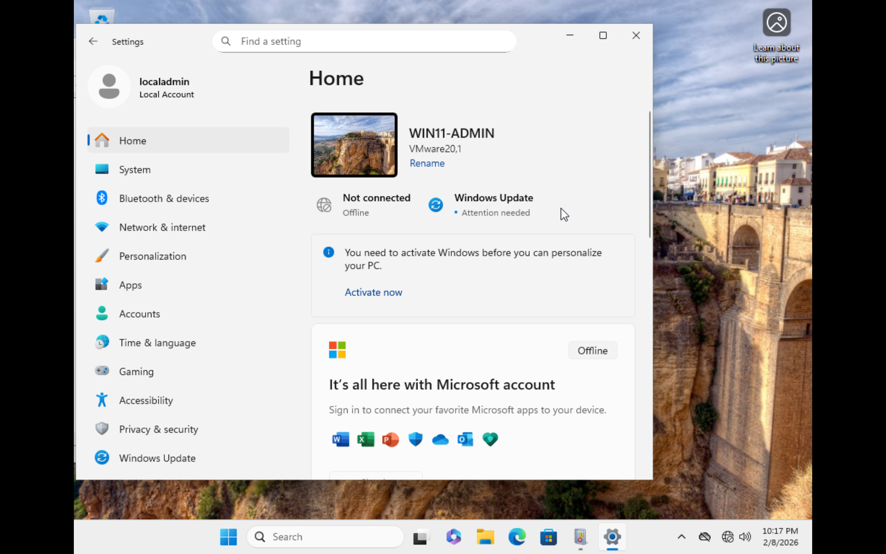
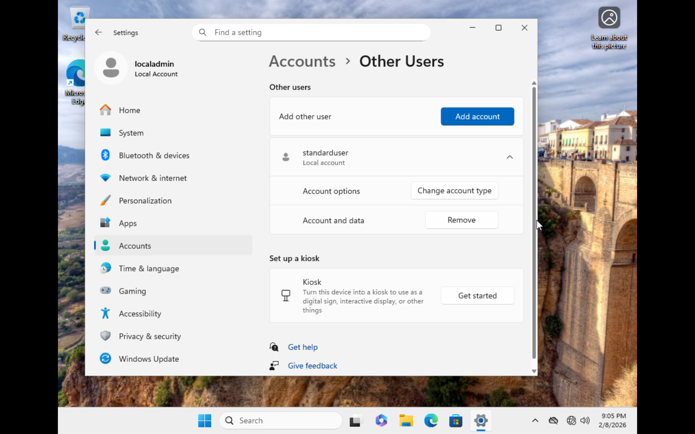

# Identity & Privilege Separation

## Objective
Implement principle of least privilege by separating administrative and standard accounts.

## System Naming Convention

Computer renamed to:
WIN11-ADMIN

## Account Structure

Accounts created:
- localadmin (Administrator)
- standarduser (Standard User)

## Evidence

