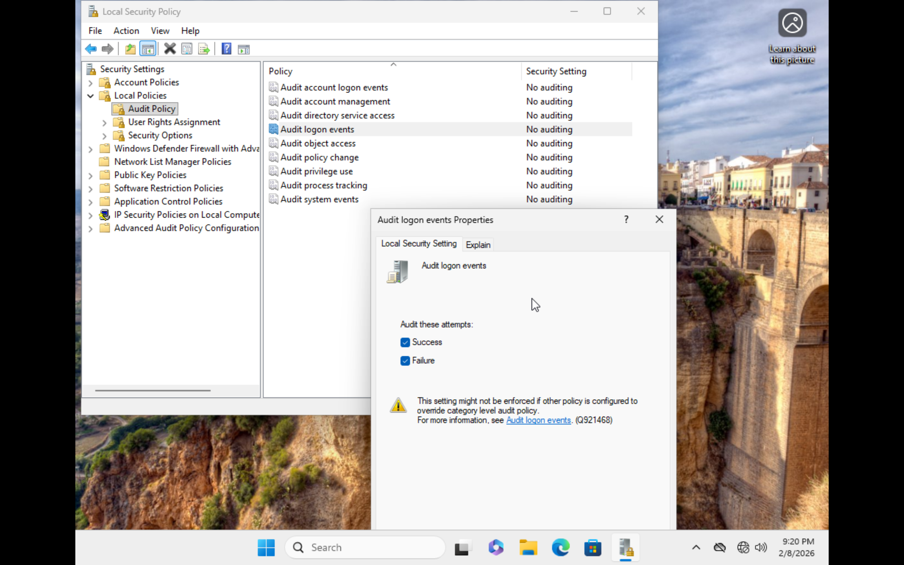
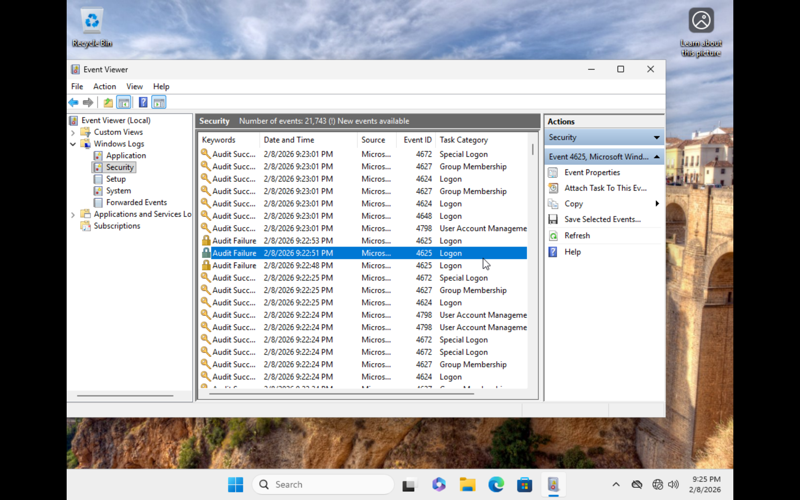

# Audit Policy Configuration & Authentication Logging

## Objective
Enable logging of authentication events for detection of suspicious behavior.

## Audit Policy Enabled

Location:
Local Security Policy → Audit Policy

Enabled:
- Audit logon events (Success)
- Audit logon events (Failure)

## Authentication Events Observed

- Event ID 4624 → Successful Logon
- Event ID 4625 → Failed Logon

## Evidence

