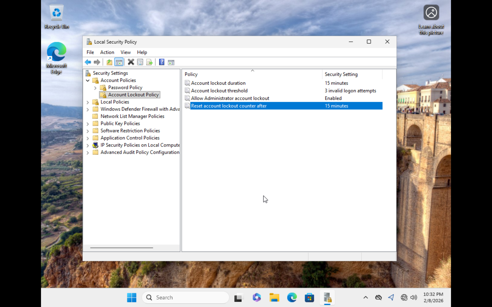
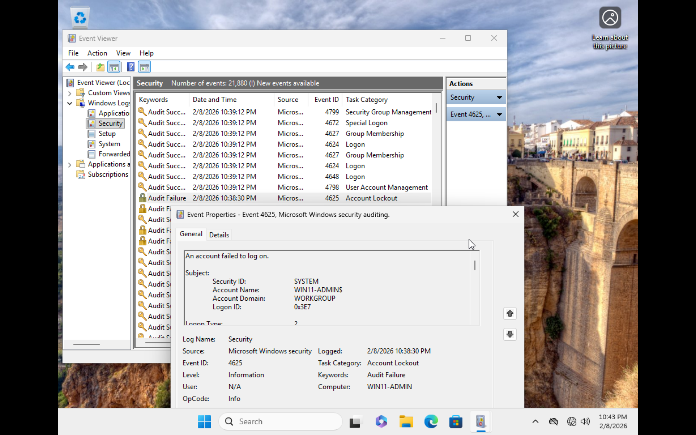

# Account Lockout Policy Configuration

## Objective
Mitigate brute-force authentication attacks by enforcing account lockout controls.

## Lockout Settings Configured

- Account lockout threshold: 3 attempts
- Lockout duration: 15 minutes
- Reset counter after: 15 minutes

## Lockout Event Observed

- Event ID 4625 → Account locked out

## Evidence

